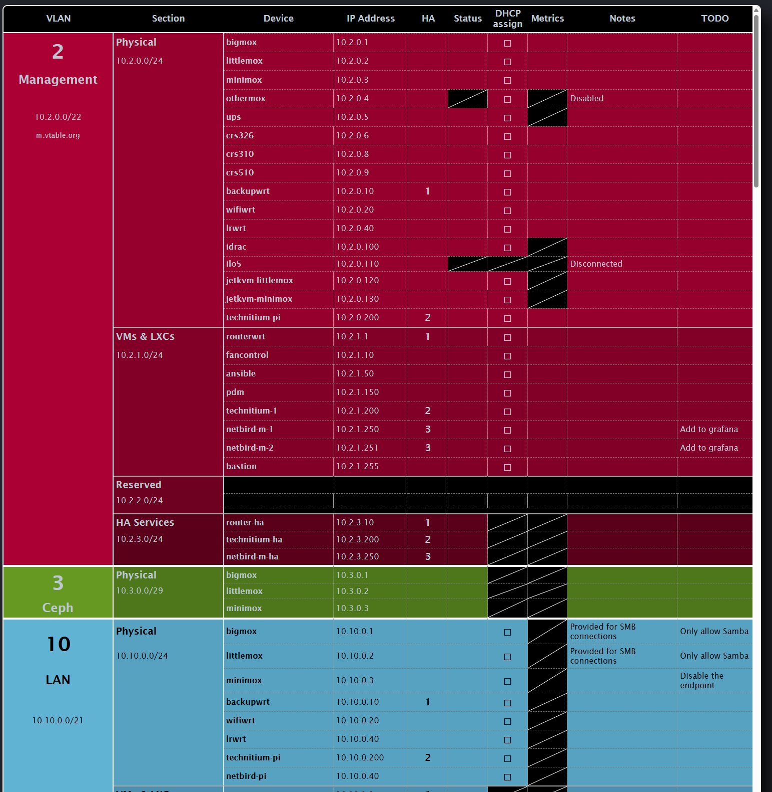

# Poor Man's IPAM
A simple IPAM solution for a home datacentre.

Screenshot (in-progress):


## What is this?
This is a very simple IPAM that allows me to keep track of the numerous systems I have in my home datacentre. Between my place, my parents' home and the village home we
have, I've managed to end up with 13 VLANs and a _lot_ of hosts.

I used to use an Excel file, but maintaining the formatting between additions and removals of the hosts was more work than I was willing to put in (in order to
keep a similar visual appearance to what you see in the screenshot).


## Status
There are a few things pending:
* VLAN Notes: This should be simple but it can mess up cell heights if it's too long. I'm still considering an approach
* Host Status: I want to make disabled hosts appear grayed out and not available ones blacked out.

_Note_: This is still the first prototype. There is code all over the place, with ugly formatting, and a few hacks here and there. I plan to improve things
to the extent I can, but the nature of the row-spannnig fields (notable the first and second columns) leads to some rather idiotic math and hard coded numbering.
It will get better!

## Why not use an existing tool?
Because they can be more complicated than I would like to set up and use, and because most of them do not allow the single-page view that I want.

I made this tool for my personal usage and as such it may or may not fit your requirements.
While I very much intend to avoid feature creep, I am open to suggestions, so feel free to contact me or create a PR. 
Just be advised that I can't make any promises as to if and when I'll merge any changes.

## Where is the docker image?
Here: https://hub.docker.com/r/ofthetimelords/vtable.pmipam

## How do I configure it?

### Hosts file
This is your source of truth.

Have a look at the [hosts example file](hosts-example.yml) (YAML). The basic syntax is shown below. Some entries can be omitted to help keep the files shorter; the default
values are shown in parentheses:

```
- name: ""                #           Give the VLAN a name
  vlanid: ""              #           A numeric VLAN ID
  cidr: ""                #           This should be a CIDR address (e.g. 10.10.0.0/24)
  domains:                # (empty)   Optionally, a list of domain names this VLAN applies to
  - ""                    #           A string value, can be anything; valid domain names are not enforce.
  baseColor: ""           #           The base colour to be applied to this section of the VLAN. Use 6 digit hex notation (e.g. #ffffff)
  endColor: ""            #           Sections listed below will have their colours altered in a gradient manner. This is the colour the final section will have
  notes: ""               # (null)    Additional notes. Not yet implemented
  sections:               #           A list of network sections. If the VLAN doesn't use any, just don't add any entries
  - name: ""              #           A name for the section
    cidr: ""              #           CIDR notation for this network section of the VLAN. Should belong in the VLAN's Network range, but it's not enforced
    hosts:                #           A list of hosts in this section. If there are no hosts, leave the list empty.
    - name: ""            #           The name of the host
      ip:                 #           The IP of the host (no CIDR notation)
      ha:                 # (null)    High Availability Group. Allows you to mark hosts that expose VRRP IPs (e.g. through keepalived) with the same (integer) identifier)
      status: ""          # (enabled) NOT IMPLEMENTED YET. enabled = the host is enabled, disabled = the host will appear grayed out, na = Status is Not Available for this host
      dhcp: ""            # (enabled) enabled = the host receives its IP via DHCP, disabled = the host has a static IP, na = DHCP assignment is not allowed for this section
      metrics: ""         # (enabled) enabled = the host has metrics (e.g. prometheus) enabled, disabled = metrics are disabled, na = metrics are not available
      notes: ""           # (null)    Additional notes for this host
      todo: ""            # (null)    ToDo text entry for this host
```

### Environment Variables
The application only uses one environment variable:
```
Hosts: /path/to/hosts.yml
```
You can give it a different name as well.

## How do I run it?
Check the *docker-compose.yml* for a simple Docker Compose manifest.

I've also added a simple Kubernetes manifest with a helper tool to allow quick edits and application of the _hosts.yaml_ file. Editing the hosts directly from the UI will
require some significant rework, UI expertise (that I don't have) and it's not planned for now.
